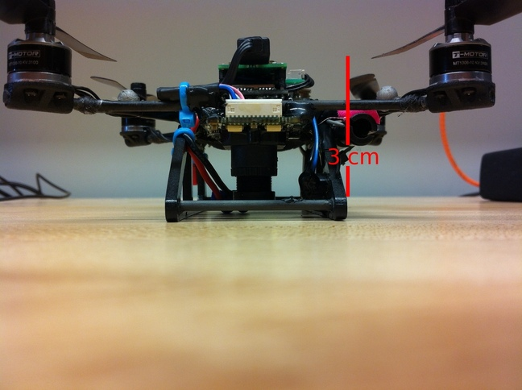
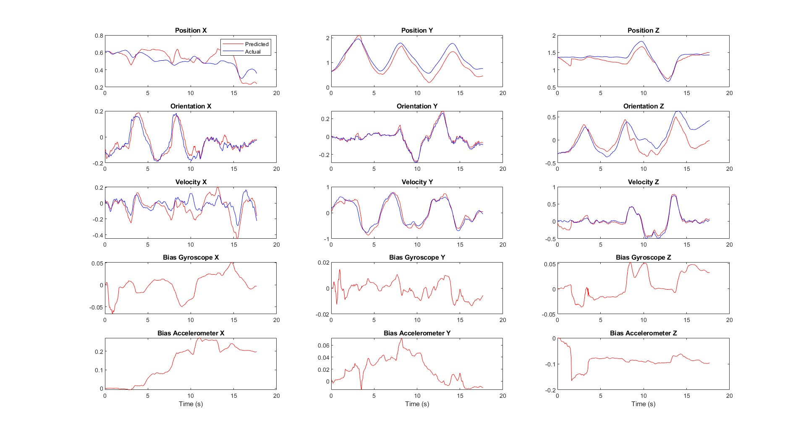

# UKF for Robust Drone Pose Estimation

This repository presents the implementation and documentation for achieving reliable drone pose estimation by fusing data from an Inertial Measurement Unit (IMU) and visual odometry using an Unscented Kalman Filter (UKF).

## Project Overview

This project tackles the challenge of precise drone localization in environments where GPS signals are unavailable. To achieve this, we explore the fusion of data from multiple onboard sensors, specifically an IMU and a camera. Sensor fusion techniques, including Kalman filters, Bayesian filters, and particle filters, are established methods for combining noisy sensor measurements to obtain a more accurate estimate of a system's state. While the standard Kalman Filter is effective for linear systems, adaptations like the Extended Kalman Filter (EKF) and the Unscented Kalman Filter (UKF) have demonstrated superior performance for non-linear systems.

  In this work, we investigate and implement the UKF to estimate a drone's position, orientation, and velocity in three-dimensional space. The filter leverages noisy velocity estimates derived from visual odometry on the drone's camera feed, along with linear acceleration and angular velocity measurements provided by the onboard IMU.

  
  

## Velocity Measurement via Optical Flow

The drone's camera feed can be utilized to estimate its velocity by analyzing optical flow. Optical flow algorithms identify and track distinct visual features across consecutive frames, calculating the pixel-wise displacement of these features. Subsequent computations on this optical flow data allow for the estimation of the camera's, and consequently the drone's body, velocity.

  While optical flow can provide reasonably accurate velocity estimates, its reliability can be compromised in scenarios involving surfaces with limited visual features or in low-light conditions. For the scope of this project, the drone is operated within a controlled environment where a mat containing Apriltags is consistently within the camera's field of view. This setup ensures that the optical flow output remains largely free from significant errors.

## Unscented Kalman Filter Implementation

For state estimation in non-linear systems like drone dynamics, the Unscented Kalman Filter (UKF) is often preferred over the Extended Kalman Filter (EKF) due to its enhanced accuracy. The UKF achieves this by discretizing the state space around a set of strategically chosen points, known as sigma points, rather than relying on a linearization of the system dynamics around the current state as in the EKF.

  The sigma points are determined based on the mean and covariance of the state estimate from the previous time step. The non-linear system dynamics model is then evaluated at these sigma points to predict the future state and measurement. The predicted and updated state values are subsequently computed as a weighted sum of the transformed sigma points. This approach allows the UKF to better capture the true mean and covariance of the state distribution after undergoing non-linear transformations.

  In this project, the drone's motion is modeled using the linear and angular acceleration measurements from the IMU as control inputs. The state variables to be estimated are the drone's position, orientation, and linear velocity in the world frame. The velocity measurements obtained through optical flow serve as the measurement variable in the filter's update step. A comprehensive mathematical treatment of the system modeling and the UKF implementation is detailed in the [report](Rajasundaram_Mathiazhagan_UKF_for_Drone_Pose_Estimation_Report.pdf) available within this repository.

## Results and Key Findings

The performance of the developed UKF for drone pose estimation was evaluated by comparing the estimated state values with ground truth data captured using a VICON motion capture system. The following graph illustrates the overlay of the estimated and ground-truth measurements over time.

  

  The Unscented Kalman Filter's covariance parameters require careful tuning to achieve optimal performance. The results presented above, obtained after initial tuning, demonstrate the filter's strong performance, with the majority of the estimated state variables closely tracking the ground truth measurements. This indicates the effectiveness of the UKF in accurately estimating the drone's pose by effectively fusing IMU and visual odometry data. 

  ## Future Work

  As a future development of this project, iterative methods for fine-tuning the UKF parameters can be explored, with the expectation of producing the best possible estimation performance.

  ## Code and Dataset

The MATLAB implementation of the UKF is included in the [Code](Code) folder within this repository. All the masurement data needed for running the code can be accessed through this [drive link](https://drive.google.com/drive/folders/1hIq_Has2JSbRs3QnnActZsRALnVl7dRr?usp=sharing).
